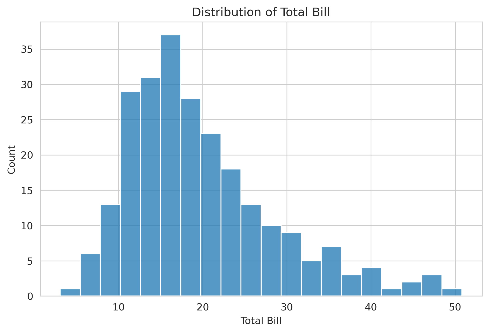
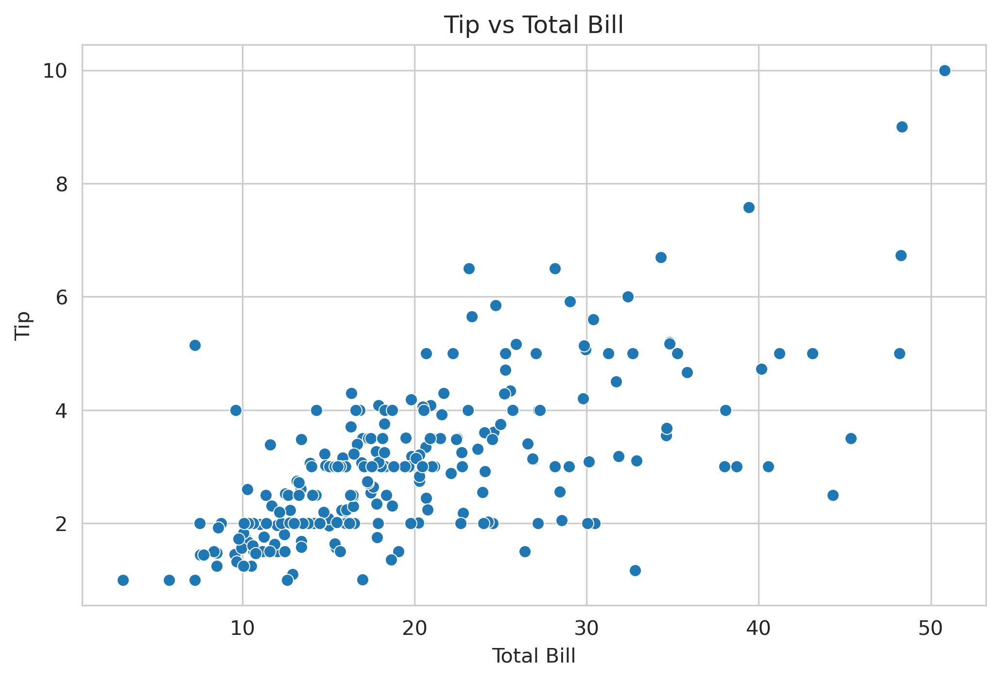
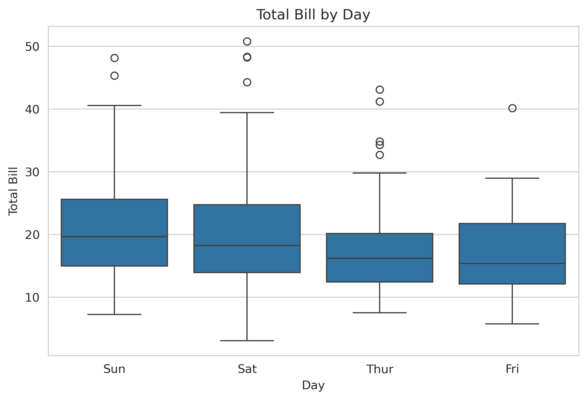

# Exploratory Data Analysis – Restaurant Sales

## Project Overview

This project performs **Exploratory Data Analysis (EDA)** on a restaurant transaction dataset to understand customer behavior, bill distribution, and tipping patterns.

The analysis focuses on identifying relationships between **total bill amount, tips, customer attributes, and visit timing**.

---

## Tools & Libraries

The analysis was performed using:

* Python
* Pandas
* Matplotlib
* Seaborn
* Jupyter Notebook

---

## Dataset

The dataset contains **244 observations** and **7 variables** describing restaurant bills.

---

### Variables

| Column     | Description                      |
| ---------- | -------------------------------- |
| total_bill | Total bill amount for the table  |
| tip        | Tip amount left by the customer  |
| sex        | Gender of the bill payer         |
| smoker     | Whether the customer is a smoker |
| day        | Day of the week                  |
| time       | Lunch or Dinner                  |
| size       | Number of people at the table    |

---


## Analytical Approach

1. Data loading and inspection
2. Dataset structure analysis
3. Statistical summary of numerical variables
4. Distribution analysis of bill amounts
5. Relationship between tips and total bill
6. Comparison of bills across days and meal times

---


## Key Visual Insights

### Distribution of Total Bills


This histogram shows that most restaurant bills fall between **10 and 25**, with fewer high-value transactions.

---


### Tip vs Total Bill


The scatterplot indicates a **positive relationship between total bill and tip amount**. Higher bills tend to generate larger tips.

---

### Total Bill by Day


The boxplot suggests that **weekend days (Sat, Sun)** tend to have higher bill variability and some high-value outliers.

---

## Key Findings

* Weekend days generate higher restaurant revenue.
* Dinner transactions tend to have higher bills than lunch.
* Larger bills generally result in larger tips.
* No strong difference in tipping behavior between smokers and non-smokers.

---

## Project Structure

```
eda-sales-analysis
│
├── data
│   └── sales_data.csv
│
├── notebooks
│   └── eda_sales_analysis.ipynb
│
├── images
│
└── README.md
```

## How to Run the Project

Clone the repository:

git clone https://github.com/zaur-israfilov/eda-sales-analysis.git
cd eda-sales-analysis

Install required libraries:

pip install pandas matplotlib seaborn jupyter

Run the notebook:

jupyter notebook

---

## Author

**Zaur Israfilov**  
Data Analyst | SQL • Python • Business Intelligence  

LinkedIn: https://linkedin.com/in/zaur-israfilov-1524b925b
